<div align="center">

# 🎛️ E-Commerce Admin Dashboard

### Mobile-first React + TypeScript admin panel for the E-Commerce .NET API — Linear/Vercel-style, JWT auth with auto-refresh, built with production-grade patterns.

[](https://ecommerce-dashboard-one-tawny.vercel.app/)
[](https://web-api-revesion-c2chh0cyctd7dpcn.eastasia-01.azurewebsites.net/swagger/index.html)
[](https://hub.docker.com/r/saif31/ecomm-api)

[](https://react.dev/)
[](https://www.typescriptlang.org/)
[](https://vitejs.dev/)
[](https://tailwindcss.com/)
[](https://tanstack.com/query)

</div>

---

## 🚀 Try It Right Now

👉 **<https://ecommerce-dashboard-one-tawny.vercel.app/>**

### 🔑 Demo Credentials (SuperAdmin)

```
Email:    superadmin@ecommerce.com
Password: SuperAdmin@123
```

Full access: manage orders, update order statuses, create/delete products, manage brands & types, assign roles, revoke user sessions.

---

## 📑 Table of Contents

1. [Screenshots](#-screenshots)
2. [Features](#-features)
3. [Tech Stack](#-tech-stack)
4. [Architecture](#-architecture)
5. [Design System](#-design-system)
6. [Project Structure](#-project-structure)
7. [Authentication Flow](#-authentication-flow)
8. [Responsive Strategy](#-responsive-strategy)
9. [Running Locally](#-running-locally)
10. [Deployment & CI/CD](#-deployment--cicd)
11. [Related Repositories](#-related-repositories)
12. [What I Learned](#-what-i-learned)

---

## 📸 Screenshots

> **Tip for adding images:** drop PNGs into `docs/screenshots/` on the repo and replace the placeholder paths below. All the `` tags will render once the files exist.

| View | Desktop (1280) | Mobile (375) |
|---|---|---|
| Overview | 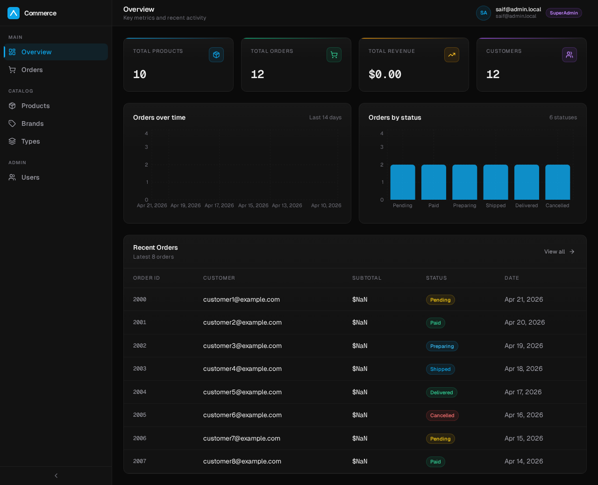 | 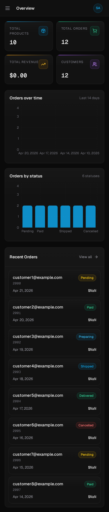 |
| Orders | 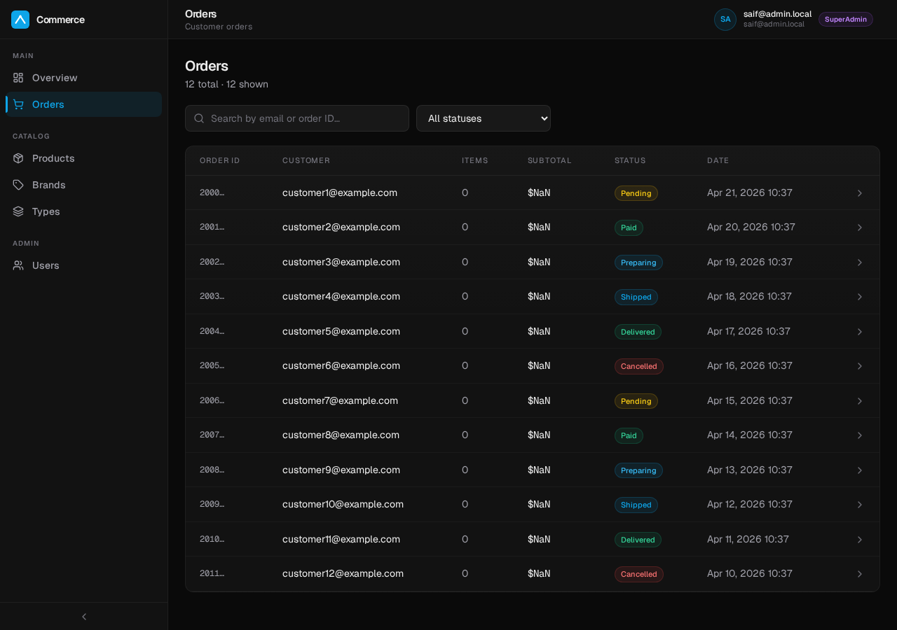 | 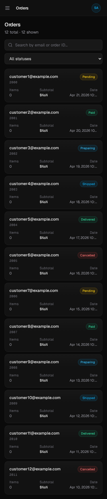 |
| Order detail | 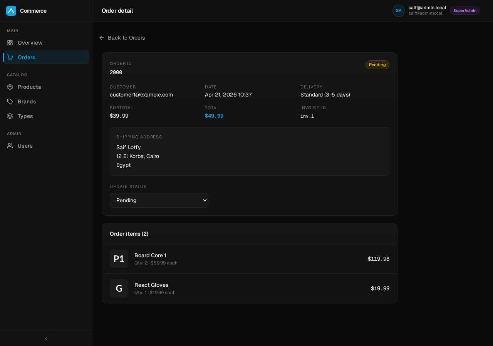 | 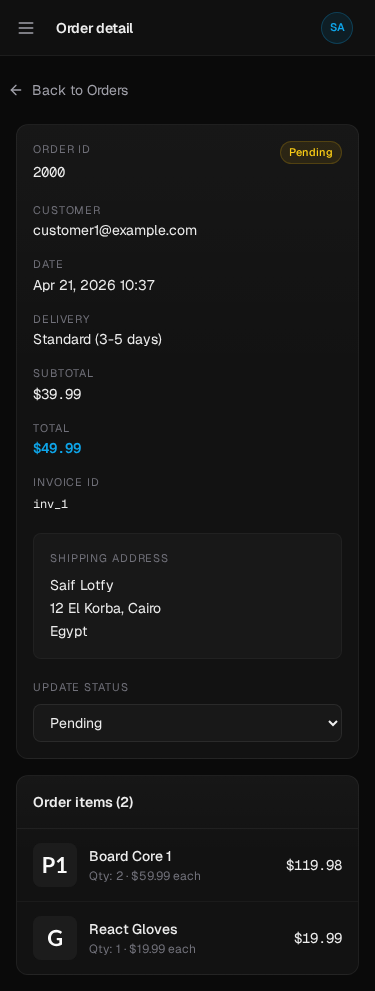 |
| Products | 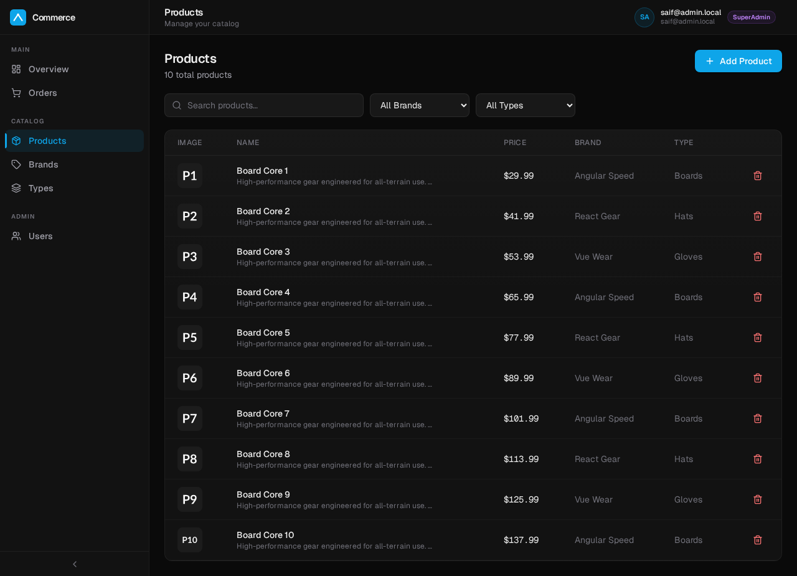 | 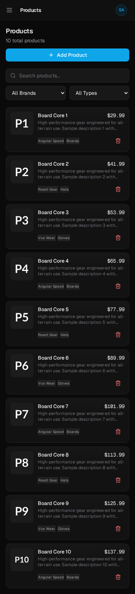 |
| Users | 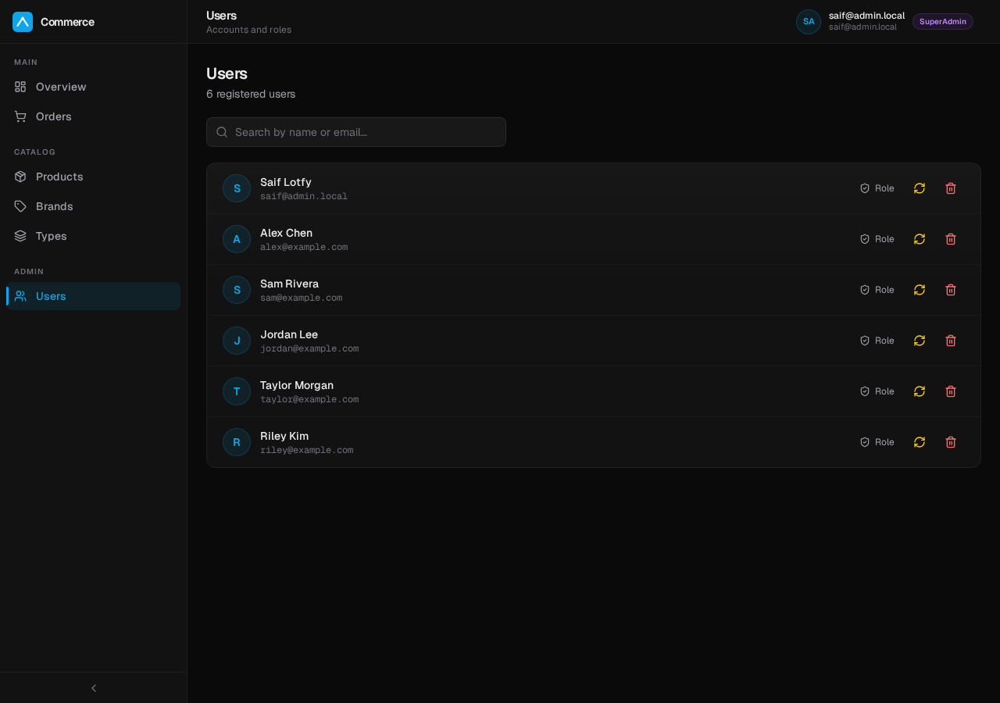 | 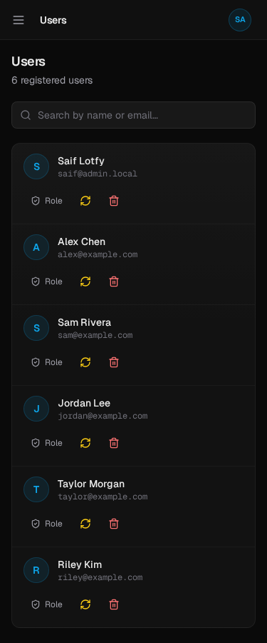 |
| Login | 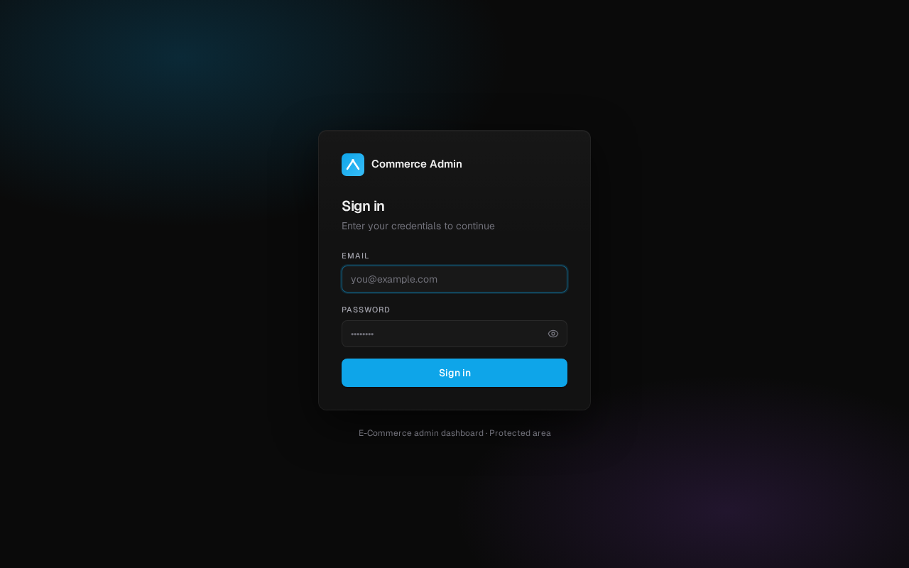 | 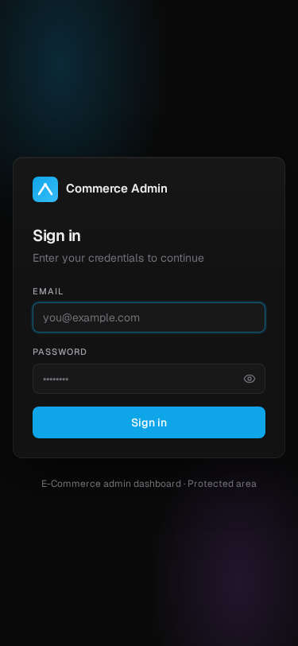 |

---

## ✨ Features

### 📊 Overview dashboard
- 4 KPI cards with gradient accent bars (Products · Orders · Revenue · Customers)
- Orders-over-time line chart (Recharts)
- Orders-by-status bar chart
- Recent orders table (desktop) ↔ card list (mobile)

### 📦 Orders
- Search by email/order ID + status filter (all 9 states)
- Responsive: table on desktop, button-card list on mobile
- Order detail page with:
  - Customer / date / delivery / subtotal / total / invoice
  - Shipping address
  - **Status state-machine dropdown** (Admin only) — API errors surface the real reason (403 / 404 / validation)
  - Line items with images, qty and per-item total

### 🛍️ Products
- Paginated list with image thumbnails
- Filter by brand + type, full-text search
- Create product modal with full form validation (react-hook-form + Zod)
- Delete with confirm dialog
- Mobile: image-left card layout with badges

### 🏷️ Brands & Types
- Simple CRUD inside a card with divider list
- Icon-chip rows, quick delete

### 👥 Users
- List with avatar initials, search by name/email
- **Assign Role** modal (User / Admin / SuperAdmin) with button grid
- **Revoke refresh token** — signs the user out immediately on all their devices
- Delete user with typed confirmation

### 🔐 Auth
- Login with show/hide password toggle
- JWT stored in Zustand + localStorage
- **Automatic token refresh** via Axios interceptor — users never hit "session expired"
- Role-based route gating (`superAdminOnly` nav items hidden for non-SuperAdmins)
- Aurora-glow login background

### 🎨 UX polish
- Skeleton loaders with shimmer animation
- Empty states with illustrated icons and CTA
- Toast notifications (sonner) with success / error tones
- Dark theme only (by design)
- Keyboard-accessible modals (Radix Dialog)
- Drag-handle bottom-sheet modals on mobile
- `safe-bottom` padding for iOS gesture bar

---

## 🧰 Tech Stack

<div align="center">

| Layer | Technology | Why |
|---|---|---|
| **Framework** | React 19 + Vite 5 | Fast HMR, modern JSX transform |
| **Language** | TypeScript 5.5 | Type safety across 30+ files |
| **Routing** | React Router v6 | Nested routes, typed params |
| **Data** | TanStack Query v5 | Cache, background refetch, mutations |
| **HTTP** | Axios + interceptors | Auto-attach JWT, auto-refresh on 401 |
| **State** | Zustand v5 | Simpler than Redux for 1 slice (auth) |
| **Forms** | React Hook Form + Zod | Zero re-renders + runtime validation |
| **Styles** | Tailwind CSS v3 | Design-token driven |
| **UI primitives** | Radix UI | Accessible dialogs, dropdowns |
| **Charts** | Recharts | Declarative, responsive out of the box |
| **Icons** | Lucide React | Tree-shakeable SVG icons |
| **Toasts** | Sonner | Best-in-class notifications |
| **Hosting** | Vercel | Zero-config CD from `main` |

</div>

---

## 🏗️ Architecture

```
┌──────────────────────────────────────────────────────────┐
│                      Pages (routes)                      │
│  Overview · Orders · OrderDetail · Products · Users · …  │
└──────────────────────────┬───────────────────────────────┘
                           │ uses
┌──────────────────────────▼───────────────────────────────┐
│           TanStack Query hooks + Mutations               │
│  useQuery(['orders', filters])    useMutation(patch)     │
└──────────────────────────┬───────────────────────────────┘
                           │ calls
┌──────────────────────────▼───────────────────────────────┐
│                    src/api/*.ts (Axios)                  │
│         auth · products · orders · users · basket        │
└──────────────────────────┬───────────────────────────────┘
                           │ HTTP with Bearer token
┌──────────────────────────▼───────────────────────────────┐
│       ECommerce .NET API (Azure App Service)             │
└──────────────────────────────────────────────────────────┘
```

**Supporting layers:**
- `src/store/authStore.ts` — Zustand slice for tokens + displayName
- `src/components/layout/` — Sidebar, MobileSidebar, Topbar, DashboardLayout
- `src/components/shared/` — Modal, ConfirmDialog, Skeleton, EmptyState
- `src/lib/utils.ts` — formatters, status config, route titles

---

## 🎨 Design System

All tokens live in **`tailwind.config.js`** and **`src/index.css`**.

### Colour palette (dark only)
```
bg        #0a0a0a      ← page background
surface   #121212      ← cards
surface-2 #181818      ← hover
surface-3 #1f1f1f      ← active
text      #ededed      ← primary text
text-2    #a1a1aa      ← secondary text
muted     #71717a      ← tertiary
accent    #0ea5e9      ← sky-500 (CTAs, links, focus)
```

### Typography
- **Sans:** Geist (fallback Inter, system sans)
- **Mono:** Geist Mono (order IDs, invoice IDs, revenue numbers)
- Tabular numerals on all money + counts

### Component classes
`.card` · `.card-interactive` · `.input` · `.label` · `.btn-primary` · `.btn-secondary` · `.btn-ghost` · `.btn-danger` · `.btn-icon` · `.badge-{success,warning,error,info,accent,purple,neutral}` · `.kpi-accent-{sky,emerald,amber,purple}` · `.page` / `.h-page` / `.h-page-sub` · `.bg-grid` · `.bg-aurora`

### Motion
```
fadeIn        0.22s ease-out      — page mounts, cards
shimmer       1.5s infinite       — skeletons
slideInLeft   0.22s spring        — mobile drawer
slideUp       0.22s spring        — bottom sheet modals
scaleIn       0.18s spring        — dialogs
```

### Elevation
Four custom shadows from `elev-1` (subtle card) → `elev-3` (modal) + `glow-accent` for focus/active CTAs.

---

## 📂 Project Structure

```
ecommerce-dashboard/
├── public/
│   └── favicon.svg
├── src/
│   ├── api/                   # Axios clients — one file per backend module
│   │   ├── axios.ts           # instance + interceptors (JWT, refresh on 401)
│   │   ├── auth.ts
│   │   ├── products.ts
│   │   ├── orders.ts
│   │   └── users.ts
│   ├── components/
│   │   ├── layout/
│   │   │   ├── Sidebar.tsx          # desktop rail + collapse
│   │   │   ├── MobileSidebar.tsx    # drawer + overlay
│   │   │   └── Topbar.tsx
│   │   └── shared/
│   │       ├── Modal.tsx            # unified API, bottom-sheet on mobile
│   │       ├── ConfirmDialog.tsx    # danger/primary tones, custom labels
│   │       ├── Skeleton.tsx         # TableSkeleton + ListSkeleton
│   │       └── EmptyState.tsx
│   ├── features/              # Domain types + helpers
│   │   ├── auth/ · orders/ · products/
│   ├── layouts/
│   │   ├── DashboardLayout.tsx      # Sidebar + Topbar + Outlet
│   │   └── AuthLayout.tsx           # aurora background
│   ├── pages/                 # One file per route
│   │   ├── OverviewPage.tsx
│   │   ├── OrdersPage.tsx
│   │   ├── OrderDetailPage.tsx
│   │   ├── ProductsPage.tsx
│   │   ├── BrandsPage.tsx
│   │   ├── TypesPage.tsx
│   │   ├── UsersPage.tsx
│   │   ├── LoginPage.tsx
│   │   └── NotFoundPage.tsx
│   ├── lib/
│   │   └── utils.ts           # formatCurrency, formatDate, ORDER_STATUS_CONFIG, cn
│   ├── store/
│   │   └── authStore.ts       # Zustand: token, refreshToken, displayName
│   ├── App.tsx                # Router + providers
│   ├── main.tsx
│   └── index.css              # Tokens + component classes + utilities
├── tailwind.config.js
├── vercel.json                # SPA rewrites
└── vite.config.ts
```

---

## 🔐 Authentication Flow

```
┌─────────────┐
│  LoginPage  │ ── POST /Authentication/Login ──▶ API
└──────┬──────┘
       │  access + refresh tokens
       ▼
┌─────────────────────┐
│ Zustand authStore   │ ── persisted to localStorage
└──────┬──────────────┘
       │ every request picks up the token
       ▼
┌─────────────────────────────┐
│  src/api/axios.ts           │
│  Request interceptor:       │
│    Authorization: Bearer …  │
│                             │
│  Response interceptor:      │
│    if (401) {               │
│      POST /RefreshToken     │
│      retry original request │
│    }                        │
└─────────────────────────────┘
```

**Outcome:** users never see "session expired" as long as their refresh token is valid. When it's not, they're redirected to `/login` automatically.

---

## 📱 Responsive Strategy

Every page is built mobile-first. Breakpoints:

```
xs  420px   ← extra-small phones
sm  640px   ← phone landscape
md  768px   ← tablet portrait
lg  1024px  ← tablet landscape / small laptop
xl  1280px  ← desktop
```

**Pattern used throughout:**
- **Tables** hidden below `md:` → replaced by a tap-friendly **card list** with the same data
- **Sidebar** becomes a **drawer** below `md:` (overlay + body-scroll lock, closes on route change)
- **Modals** become **bottom sheets** below `sm:` (drag handle, `safe-bottom` padding for iOS)
- **Filter bars** stack vertically on mobile
- **Forms** use `grid-cols-1 sm:grid-cols-2` for adaptive columns

Tested with Playwright at **375 / 768 / 1280** — every page reviewed pixel-by-pixel for overflow, truncation, and contrast issues.

---

## 🏃 Running Locally

### Prerequisites
- Node 18+
- A running backend — either:
  - **Easy:** `docker run -p 5262:8080 saif31/ecomm-api:latest` (plus SQL Server + Redis; see backend [docker-compose.yml](https://github.com/sefffo/Web-API-Revision/blob/master/docker-compose.yml))
  - **Or:** point to the live Azure API (no setup)

### Install & run

```bash
git clone https://github.com/sefffo/ecommerce-dashboard.git
cd ecommerce-dashboard
npm install
npm run dev          # http://localhost:5173
```

### Scripts
```bash
npm run dev      # Vite dev server with HMR
npm run build    # tsc + Vite production build → dist/
npm run preview  # Preview the production build locally
```

### Configure API base URL

Create **`.env.local`**:

```env
VITE_API_BASE_URL=https://web-api-revesion-c2chh0cyctd7dpcn.eastasia-01.azurewebsites.net
```

---

## 🚀 Deployment & CI/CD

### Hosting — Vercel

```
┌───────────────────────────────────┐      ┌───────────────────┐
│  git push origin main             │      │      Vercel       │
└────────────┬──────────────────────┘      │                   │
             ▼                              │  Auto-detected:   │
┌──────────────────────────────────┐        │  · Framework Vite │
│  Vercel build hook fires         │ ─────▶ │  · Build: npm run │
│                                  │        │      build        │
│  1. Install deps                 │        │  · Output: dist/  │
│  2. tsc && vite build            │        │                   │
│  3. Deploy /dist to edge CDN     │        │  SPA rewrites via │
└──────────────────────────────────┘        │  vercel.json      │
                                            └───────────────────┘
```

- **`vercel.json`** rewrites all routes to `/index.html` so React Router handles client-side routing.
- Every commit to `main` = production deploy in ~30s.
- Every PR = instant preview URL for review.

### Branch strategy

```
main ─────────────────────────────────▶ (production, auto-deploys)
  ▲                    ▲
  │ squash-merged PRs  │
  │                    │
feat/orders-fix  feat/responsive-ui-refresh  ...
```

See the full PR history here: <https://github.com/sefffo/ecommerce-dashboard/pulls?q=is%3Apr+is%3Aclosed>

---

## 🔗 Related Repositories

| Repo | Purpose |
|---|---|
| [**Web-API-Revision**](https://github.com/sefffo/Web-API-Revision) | ASP.NET Core 10 backend (this dashboard's data source) |
| [**Docker image**](https://hub.docker.com/r/saif31/ecomm-api) | Pre-built backend image on Docker Hub |

---

## 🎓 What I Learned

| Area | Takeaway |
|---|---|
| **Type-safe API layer** | One Axios file per backend module + typed return values caught 3 bugs at compile-time |
| **TanStack Query** | Caching + background refetch = no manual loading states, auto-retries |
| **Zustand** | Redux is overkill for 1 slice of global state; Zustand is 40 lines and does the job |
| **Axios interceptors** | Refresh-on-401 + retry original = users never see "session expired" |
| **React Hook Form + Zod** | Zero uncontrolled-input re-renders + runtime + compile-time safety |
| **Radix UI** | Accessibility comes free — keyboard, focus-trap, ARIA |
| **Tailwind design tokens** | Centralizing colour + motion tokens = consistent look across 9 pages |
| **Mobile-first CSS** | Writing mobile styles first (then `md:` overrides) eliminated 90% of media-query bugs |
| **Radix Dialog → bottom sheet** | Same primitive; CSS flips orientation at `sm:` with `safe-bottom` + drag handle |
| **Cache-invalidation front-end side** | `queryClient.invalidateQueries(['orders'])` after mutation → automatic refetch, no stale lists |
| **Production JSON-casing bug** | Hit a camelCase-vs-PascalCase cache bug from the backend; added a `normalizeOrder` shim as defense-in-depth |
| **Playwright visual QA** | Built a script that screenshots every page at 375 / 768 / 1280 with mocked API — caught 5 layout bugs before shipping |
| **Real PR workflow** | Every change went through a branch + PR + review cycle — 3 merged PRs worth reading |

---

<div align="center">

### 🔗 Links

[**Live Dashboard**](https://ecommerce-dashboard-one-tawny.vercel.app/) · [**Backend Repo**](https://github.com/sefffo/Web-API-Revision) · [**Backend Swagger**](https://web-api-revesion-c2chh0cyctd7dpcn.eastasia-01.azurewebsites.net/swagger/index.html) · [**Docker Hub**](https://hub.docker.com/r/saif31/ecomm-api)

---

**Built by [Saif Lotfy](https://www.linkedin.com/in/saif-lotfy-769451310/)** — backend engineer, Cairo 🇪🇬

*If this project helped you or inspired your own build, a ⭐ on the repo would mean the world.*

</div>
